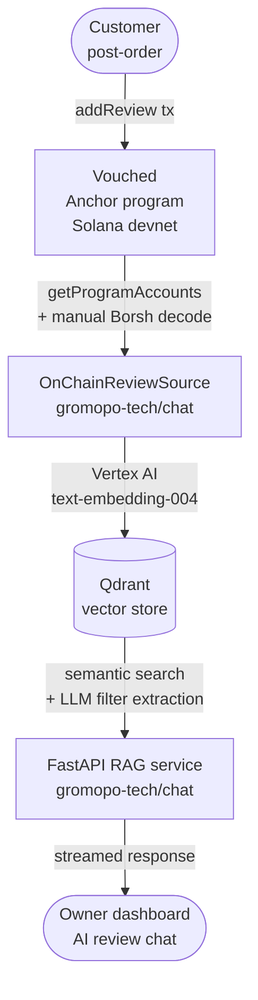

# Vouched

## Part of the Gromopo System

Vouched is the on-chain review layer for [Gromopo](https://github.com/gromopo-tech/gromopo), a Solana-based restaurant ordering platform. After a customer completes a USDC payment through Gromopo, they are prompted to leave a review via this Anchor program. Reviews are purchase-verified — the reviewer must use the same wallet they paid with. Reviews are stored on-chain as PDA accounts (one per wallet per restaurant), then periodically indexed by an off-chain Python service ([gromopo-tech/chat](https://github.com/gromopo-tech/chat)) using `solders` + manual Borsh deserialization — deserializing account state and upserting into a Qdrant vector store so restaurant owners can query their review data through an AI-powered chat interface.



**Program ID:** `A1sSsTDoDrBkJ96fuHo9G89gHsEXVvcW6tNV39AfyWbF` (Solana devnet)

**Related repos:**
- [gromopo-tech/gromopo](https://github.com/gromopo-tech/gromopo) — Next.js ordering platform (calls this program post-order)
- [gromopo-tech/chat](https://github.com/gromopo-tech/chat) — RAG service that indexes these on-chain reviews

---

## Getting Started

### Prerequisites

- [Rust](https://www.rust-lang.org/tools/install)
- [Solana CLI](https://docs.solanalabs.com/cli/install)
- [Anchor CLI](https://www.anchor-lang.com/docs/installation)
- Node.js 20+ and yarn

### Install dependencies

```shell
yarn install
```

## Commands

#### Build the program

```shell
yarn anchor-build
```

#### Start the local test validator with the program deployed

```shell
yarn anchor-localnet
```

#### Run the tests

```shell
yarn anchor-test
```

#### Deploy to Devnet

```shell
yarn anchor-deploy
```

#### Sync the program ID (after redeploying)

If you generate a new keypair, update the program ID in `Anchor.toml`, `programs/review/src/lib.rs` (`declare_id!`), and `src/review-exports.ts`.

```shell
anchor keys sync
```

#### Seed devnet with fixture reviews

The `seed_devnet.ts` script submits ~8 varied reviews to devnet for use as eval fixtures. Each review is submitted from your local wallet as the reviewer, targeting a fixed merchant public key. Duplicate reviews (same reviewer + reviewee PDA) are skipped automatically.

**1. Check your devnet balance and airdrop if needed:**

```shell
solana balance --url devnet
solana airdrop 2 --url devnet
```

**2. Run the seed script:**

```shell
yarn seed-devnet
```

The script prints a JSON array of `{ pda, reviewer, reviewee, rating, comment, txSignature }` objects to stdout.

**3. Verify a PDA on-chain:**

Copy a `pda` address from the output, then:

```shell
solana account <pda_address> --url devnet
```

**4. Cache the seed data as an eval fixture for the chat service:**

```shell
yarn seed-devnet > ../chat/eval/onchain_seed_data.json
```

Or to capture both stdout (JSON) and stderr (progress logs):

```shell
yarn seed-devnet 2>&1 | tee /tmp/seed-output.txt
```
